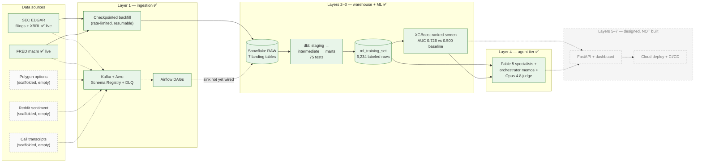

# EDGAR-X

**A financial data platform that ingests real SEC EDGAR and FRED data into Snowflake, transforms it with a fully-tested dbt pipeline, and trains a revenue-direction model on 19 fiscal years of labeled S&P 500 fundamentals (FY2007–FY2025, excluding Financials).**


EDGAR-X pulls 10-K filings and XBRL fundamentals for 498 current S&P 500 companies directly from the SEC, joins them with macro indicators from FRED, and asks a deliberately modest question: *given everything knowable on the day a company files its 10-K, will next year's revenue be higher?* Answering it honestly required solving the real problems of financial data engineering — XBRL tag migrations, silent API pagination truncation, REIT accounting quirks, and filer sign errors — each of which was caught by an automated data test, not by luck. The result is a ranked screen with test ROC-AUC 0.726 against a 0.5 majority baseline, reported with its limitations attached.

## Built vs planned

This repo is honest about its own state. Layers 1–4 are built; all real data was loaded through the checkpointed backfill path (source APIs → Snowflake directly). Layers 5–7 (self-improvement, API/dashboard, cloud deployment) are designed but **not built**.

| Layer | Scope | Status |
|---|---|---|
| 1 | Ingestion: async API clients + checkpointed backfill (the real data path); Kafka/Avro producers, DLQs, and Airflow DAGs built and unit-tested, but the Kafka→Snowflake sink is **not yet wired** | ✅ Built (see note) |
| 2 | dbt transformations: 7 staging / 5 intermediate / 6 mart models, 75 tests, DuckDB dev + Snowflake prod targets | ✅ Built |
| 3 | ML: S&P 500 backfill (ex-Financials), labeled training mart, XGBoost vs two baselines, SHAP, model card | ✅ Built |
| 4 | LLM agent tier: three attributed specialist agents (extraction / comparison / signal), a Claude Fable 5 orchestrator producing source-grounded memos with code-supplied provenance, and an LLM-as-judge evaluation harness (Claude Opus 4.8). Demonstrated on 5 companies across 3 sectors, avg judge scores 4.6/5/5/5 | ✅ Built |
| 5 | Self-improvement loop (outcome tracking, model retraining triggers) | 📋 Planned, not built |
| 6 | FastAPI service + Streamlit dashboard | 📋 Planned, not built |
| 7 | Cloud deployment (Terraform/Kubernetes), CI/CD, monitoring | 📋 Planned, not built |

Layer 4 demo evidence — generated memos, per-company judge reports, scores, and full cost accounting: [docs/sample_memos/README.md](docs/sample_memos/README.md).

## Architecture



Solid lines are the only path real data has taken: the checkpointed backfill script writes EDGAR + FRED to Snowflake directly. The Kafka producers, Avro schemas, and Airflow DAGs (dashed) are built and unit-tested, but the Kafka→Snowflake sink is not yet wired, and no scheduled DAG run has landed real data in the warehouse — streaming-to-warehouse is built in parts and planned for completion. Dashed boxes are scaffolded-but-empty streams and unbuilt layers.

## What's real (exact numbers)

- **498 of 503** current S&P 500 constituents loaded (5 dropped: GS, SYF, TFC, APA, FDXF — mostly banks whose revenue isn't expressible in the XBRL concepts used)
- **7,863** company-fiscal-year fundamentals rows (FY2007–FY2026), extracted from SEC XBRL companyfacts
- **4,758** real 10-K filings downloaded and section-parsed (MD&A, risk factors)
- **11,583** FRED macro observations (6 series, 2005→present)
- **6,234** labeled training rows (FY2007–FY2025) / 469 inference rows in the ML mart. The raw fundamentals reach FY2026, but FY2026 rows are inference-only — FY2027 revenue doesn't exist yet to label them (likewise most FY2025 rows, pending each company's FY2026 filing) — which is why the newest fiscal year never appears in training or test.
- **2 of 5 data streams carry real data** (EDGAR, FRED). Options, sentiment, and transcript pipelines are fully scaffolded — clients, Avro schemas, Kafka topics, empty RAW tables — but deliberately unpopulated.
- **All real data was loaded via the direct backfill script**, not through Kafka. The Kafka producers, Avro schemas, and Airflow DAGs are built and unit-tested, but the Kafka→Snowflake sink is not wired and no scheduled DAG run has landed real data in the warehouse yet.
- **Financials (~70 companies) are excluded** from the ML dataset: bank/insurer revenue is not captured by the XBRL revenue concepts this project extracts, and the data proved it (computed "margins" above 1.0). Every claim here is about the *S&P 500 excluding Financials*.
- This is **production-quality engineering running on a laptop** — typed, tested, idempotent, logged — not a deployed production system.

## Results — read AUC, not accuracy

Time-based split: train FY2007–2023 (5,787 rows), test FY2024–2025 (447 rows, **83% positive base rate**). Test set touched exactly once, after Optuna tuning on train-years-only.

| model | accuracy | precision | recall | F1 | **ROC-AUC** |
|---|---|---|---|---|---|
| majority class ("always up") | 0.830 | 0.830 | 1.000 | 0.907 | 0.500 |
| logistic regression | 0.834 | 0.838 | 0.992 | 0.909 | 0.607 |
| **XGBoost (tuned)** | 0.830 | 0.830 | 1.000 | 0.907 | **0.726** |

The honest interpretation: at a 0.5 threshold XGBoost predicts "up" for every test row — accuracy equals the base rate and means nothing. What the model actually delivers is **ranking**: AUC 0.726 means a randomly chosen revenue-decliner scores below a grower 73% of the time. **This is a ranked screen, not a classifier.** SHAP attribution: fundamentals 39%, macro regime 29%, sector 16%, filing-language 16% (language covers only 56% of rows — present but unproven). Full details and limitations: [model card](ml/revenue_predictor/artifacts/MODEL_CARD.md) · [case study](docs/CASE_STUDY.md).

## Engineering highlights

- **dbt data tests caught four real extraction bugs** — an NVDA XBRL tag migration, REIT revenue-component shadowing, DuPont's literally negative restated debt, and EDGAR pagination truncation. Each became a regression test. The [case study](docs/CASE_STUDY.md) tells all four stories.
- **Idempotent, checkpointed backfill**: per-company delete-before-insert with JSON checkpointing — a crash mid-run resumes without duplicating a row, at SEC's 10 req/sec fair-access cap.
- **Key-pair (JWT) Snowflake auth** throughout — no passwords anywhere; all config via environment.
- **Leakage-disciplined ML**: time-based splits everywhere (even inside hyperparameter tuning), features restricted to filing-date information, mandatory baselines.
- **Typed and tested throughout**: Pydantic v2 at module boundaries, 124 unit tests at 93% coverage, structlog JSON logging, dead-letter queues so poison messages never block a partition.

## Quickstart

```bash
# 1. Configure (SEC requires a User-Agent with contact email; add API keys)
cp .env.example .env

# 2. Local infrastructure: Kafka, Schema Registry, Airflow, Redis, Postgres
docker compose up -d              # Airflow UI: localhost:18080

# 3. Python environment
python3 -m venv .venv && source .venv/bin/activate
pip install -e '.[dev]'
pytest                            # 124 tests, 93% coverage (80% gate)

# 4. Real-data backfill into Snowflake (requires SNOWFLAKE_* key-pair config)
set -a; source .env; set +a
python scripts/build_universe.py            # S&P 500 -> CIK mapping
python scripts/backfill_universe.py --sample 20   # checkpointed; resumable
python scripts/backfill_universe.py               # full universe (~hours)

# 5. Transform + test (75 dbt tests)
cd transforms/dbt
dbt build --target prod --profiles-dir .    # or: dbt seed && dbt build (local DuckDB dev)

# 6. Train and evaluate the model
cd ../.. && python -m ml.revenue_predictor.train
```

## Tech stack (only what's actually used)

Python 3.11+ (httpx, asyncio, Pydantic v2) · Apache Kafka + Avro + Schema Registry · Apache Airflow · Snowflake (key-pair auth) + DuckDB dev target · dbt · XGBoost + Optuna + SHAP · Anthropic SDK (Claude Fable 5 + Opus 4.8, prompt caching, hard spend caps) · Docker Compose · pytest + ruff

## Repository map

```
ingestion/    async API clients, Kafka/Avro producers+consumers+DLQ, Airflow DAGs, Snowflake writer
transforms/   dbt project: staging -> intermediate -> marts, 75 tests, dev/prod targets
ml/           revenue-direction model: feature engineering, training, artifacts + model card
scripts/      universe builder, checkpointed backfills
tests/        124 unit tests (all external I/O mocked)
docs/         engineering case study
agents/       Layer-4 agent tier: cost-capped base agent, three attributed specialists,
              orchestrator (source-grounded memos), LLM-as-judge evaluation
api/ dashboard/   placeholders for planned Layers 5-7 (not built)
```
